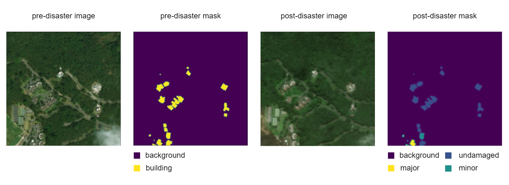
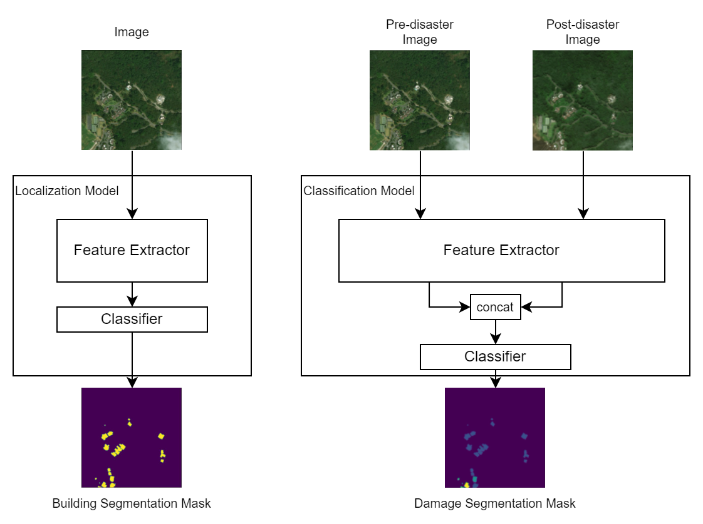
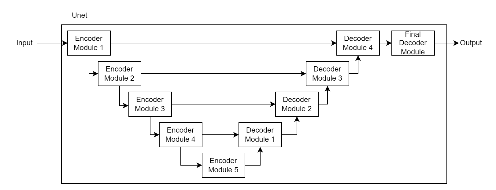
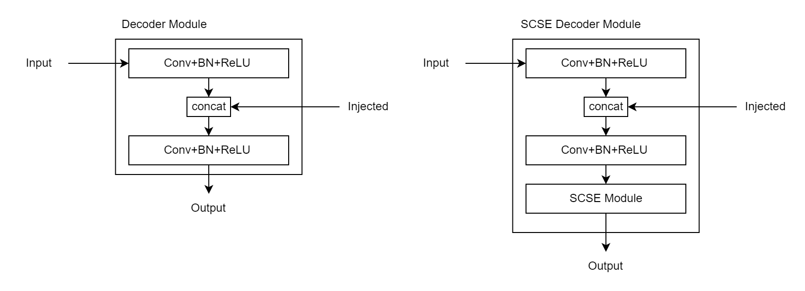
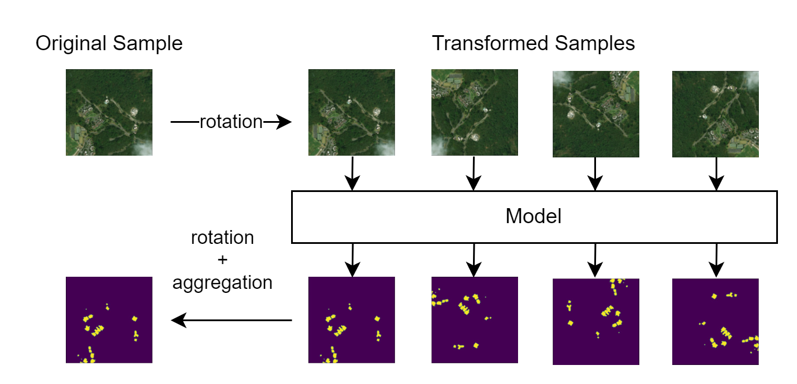

# MetaDamageNet

#### Using Deep Learning To Identify And Classify Damage In Aerial Imagery

This project is my bachelors thesis at AmirKabir University of Technology under supervision of Dr.Amin Gheibi.
Some ideas of this project is borrowed from
[xview2 first place solution](https://github.com/vdurnov/xview2_1st_place_solution)
repository. I used that repository as a baseline and refactored its code.
Thus, this code covers models and experiments of the mentioned repo and
contributes more research into the same problem of damage assessment in aerial imagery.

### environment setup

```bash
git clone https://github.com/nimaafshar/metadamagenet.git
cd metadamagenet/
pip install -r requirements.txt
```

### examples

- [create segmentation masks from json labels](./create_masks.py)
- [`Resnet34Unet` training and tuning](./example_resnet34.py)
- [`SeResnext50Unet` training and tuning](./example_seresnext50.py)
- [`Dpn92Unet` training and tuning](./example_dpn92.py)
- [`SeNet154Unet` training and tuning](./example_dpn92.py)

### table of contents

- [MetaDamageNet](#metadamagenet)
      - [Using Deep Learning To Identify And Classify Damage In Aerial Imagery](#using-deep-learning-to-identify-and-classify-damage-in-aerial-imagery)
    - [environment setup](#environment-setup)
    - [examples](#examples)
    - [table of contents](#table-of-contents)
  - [Data](#data)
    - [Augmentations](#augmentations)
  - [Methodology](#methodology)
    - [General Architecture](#general-architecture)
    - [U-Models](#u-models)
      - [Decoder Modules](#decoder-modules)
      - [Backbone](#backbone)
    - [Meta-Learning](#meta-learning)
    - [Vision Transformer](#vision-transformer)
    - [Training Setup](#training-setup)
    - [Loss Functions](#loss-functions)
  - [Evaluation](#evaluation)
    - [Localization Models Scoring](#localization-models-scoring)
    - [Classification Models Scoring](#classification-models-scoring)
    - [Test-Time Augment](#test-time-augment)
    - [Training Results](#training-results)
  - [Conclusion and Acknowledgments](#conclusion-and-acknowledgments)

## Data



We are using the xview2 challenge dataset, namely Xbd, as the dataset for our project. This dataset contains pairs of pre and post-disaster satellite images from 19 natural disasters worldwide, including fires, hurricanes, floods, and earthquakes. Each sample in the dataset consists of a pre-disaster image with its building annotations and a post-disaster image with the same building annotations. However, in the post-disaster building annotations, each building is a damage level of the following: undamaged, minor-damage, major damage, destroyed, and unclassified. The dataset consists of train, tier3, test, and hold subsets. Each subset has an images folder containing pre and post-disaster images stored as 1024*1024 PNG and a folder named labels containing building annotations and damage labels in JSON format. We can convert this building (annotated as polygons) to a binary mask. We can also convert the damage levels to values 1-4 and use them as the value for all the pixels in their corresponding building, forming a semantic segmentation mask. Thus, we define the building localization task as predicting each pixel's value being zero or non-zero. We also define the damage classification task as predicting the exact value of pixels within each building. We consider the label of an unclassified building as undamaged, as it is the most common label by far. Some of the post-imagery is slightly shifted from their corresponding pre-image. Also, the dataset has different ground sample distances. We used the train and tier3 subsets for training, the test subset for validation, and the hold subset for testing. The dataset is highly unbalanced in multiple aspects. The buildings with the undamaged label are far more than buildings with other damage types. The number of images varies a lot between different disasters; the same is true for the number of building annotations in each disaster.

<details>
<summary>
Folder Structure
</summary>

```
dataset
├── test
|   └── ... (similar to train)
├── hold
|   └── ... (similar to train)
├── tier3
|   └── ... (similar to train)
└── train
    ├── images
    │   ├── ...
    │   ├── {disaster}_{id}_post_disaster.png
    │   └── {disaster}_{id}_pre_disaster.png
    ├── labels
    │   ├── ...
    │   ├── {disaster}_{id}_post_disaster.json
    │   └── {disaster}_{id}_pre_disaster.json
    └── targets
        ├── ...
        ├── {disaster}_{id}_post_disaster_target.png
        └── {disaster}_{id}_pre_disaster_target.png
```

</details>

<details>
<summary>Example Usage</summary>

```python
from pathlib import Path
from metadamagenet.dataset import LocalizationDataset, ClassificationDataset

dataset = LocalizationDataset(Path('/path/to/dataset/train'))
dataset = ClassificationDataset([Path('/path/to/dataset/train'),Path('/path/to/dataset/tier3')])
```

</details>

### Augmentations

<details>
<summary>
Example Usage
</summary>

```python
import torch
from metadamagenet.augment import Random, VFlip, Rotate90, Shift, RotateAndScale, BestCrop, OneOf, RGBShift, HSVShift, Clahe, GaussianNoise, Blur, Saturation, Brightness, Contrast, ElasticTransform

transform = nn.Sequential(
        Random(VFlip(), p=0.5),
        Random(Rotate90(), p=0.95),
        Random(Shift(y=(.2, .8), x=(.2, .8)), p=.1),
        Random(RotateAndScale(center_y=(0.3, 0.7), center_x=(0.3, 0.7), angle=(-10., 10.), scale=(.9, 1.1)), p=0.1),
        BestCrop(samples=5, dsize=(512, 512), size_range=(0.45, 0.55)),
        Random(RGBShift().only_on('img'), p=0.01),
        Random(HSVShift().only_on('img'), p=0.01),
        OneOf(
            (OneOf(
                (Clahe().only_on('img'), 0.01),
                (GaussianNoise().only_on('img'), 0.01),
                (Blur().only_on('img'), 0.01)), 0.01),
            (OneOf(
                (Saturation().only_on('img'), 0.01),
                (Brightness().only_on('img'), 0.01),
                (Contrast().only_on('img'), 0.01)), 0.01)
        ),
        Random(ElasticTransform(), p=0.001)
    )

inputs = {
  'img':torch.rand(3,3,100,100),
  'msk':torch.randint(low=0,high=2,size(3,100,100))
  }
outputs = transform(inputs)
```

</details>

Data Augmentation techniques help generate new valid samples from the dataset. Hence, they provide us with more data, help the model train faster, and prevent overfitting. Data Augmentation is vastly used in training computer vision tasks, from image classification to instance segmentation. in most cases, data augmentation is done randomly. This randomness means it is not done on some of the original samples, and the augmentation has some random parameters. Most libraries used for augmentation, like open-cv (cite), do not support image-batch transforms and only perform transforms on the CPU. Kornia (cite) is an open-source differentiable computer vision library for PyTorch; it does support image-batch transforms, and it does support performing these transforms on GPU. We used Kornia and added some parts to it to suit our project requirements.

We created a version of each image transformation that supports our needs. Its input is multiple batches of images, and each batch has a name. for example, an input contains a batch of images and a batch of corresponding segmentation masks. In some transformations like resize, the same parameters (in this case, scale) should be used for transforming both images and segmentation masks. In some transformations, like channel shift, the transformation should not be done on the segmentation masks. Another requirement is that the transformation parameters can differ for each image and its corresponding mask in the batch.
Furthermore, a random augmentation should generate different transformation parameters for each image in the batch. Moreover, it should consider that the transformation does not apply to some images in the batch. Our version of each transformation meets these requirements.


## Methodology

<details>
<summary>Example Usage</summary>

```python
from metadamagenet.models import Localizer
from metadamagenet.models.unet import EfficientUnetB0


# define localizer of unet
class EfficientUnetB0Localizer(Localizer[EfficientUnetB0]): pass


# load pretrained model
pretrained_model = EfficientUnetB0Localizer.from_pretrained(version='00', seed=0)

# load an empty model
empty_model = EfficientUnetB0Localizer()

# load a model from pretrained unet
unet: EfficientUnetB0  # some pretrained unet
model_with_pretrained_unet = EfficientUnetB0Localizer(unet)

# load an empty unet
empty_unet = EfficientUnetB0()

# load a unet with pretrained backbone
unet_with_pretrained_backbone = EfficientUnetB0(pretrained_backbone=True)
```

</details>

### General Architecture

As shown in the figure below, building-localization models consist of a feature extractor (a U-net or a SegFormer) and a
classifier module.
The feature extractor extracts helpful features from the input image;
then, the classifier module predicts a value of 0 or 1 for each pixel,
indicating whether this pixel belongs to a building or not.
The feature extractor module extracts the same features from pre-disaster and post-disaster images in the classification
models.
In these models, the classifier module predicts a class between 0 and 4 for each pixel.
The value 0 indicates that this pixel belongs to no building;
values 1-4 mean that this pixel belongs to a building and show the damage level in that pixel.
The classifier module learns a distance function between pre-disaster and post-disaster images
because the damage level of each facility can be determined by comparing it in the pre- and post-disaster images.
In many samples, the post-disaster image has a minor shift compared to the pre-disaster image;
the segmentation masks are created based on the location of buildings in the pre-disaster image.
This shift is an issue the model has to overcome. For models that share a joint feature extractor,
we can initialize the feature extractor module in the classification model with the localization model's feature
extractor.
Since we do not use the localization model directly for damage assessment, training of the localization model can be
seen as a pre-training stage for the classification model.



### U-Models

Some models in this project use a U-net module as the feature extractor and a superficial 2d Convolutional Layer as the
classifier.
We call them u-models. Their feature extractor module is a u-net with five encoder and five decoder modules.
Encoder models are usually a part of a general feature extractor like Resnet-34.
in the forward pass of each image through an encoder module, the number of channels may or may not change.
Still, the height and width of the image are divided by two.
Usually, the five encoder modules combined include all layers of a general feature extractor model (like Resnet34)
except the classification layer.
Each decoder module combines the output of the previous decoder module and the respective encoder module.
For example, encoder module 2 combines the output of decoder module 1 and encoder module 3.
They form a U-like structure, as shown in the figure below.



#### Decoder Modules

There are two variants of decoder modules:
The standard decoder module and the SCSE decoder module.
The standard decoder module applies a 2d convolution and a Relu activation to the input from the previous decoder.
Then it concatenates the result with the input from the respective encoder module and applies another 2d convolution and
ReLU activation.
SCSE decoder module works the same way but, in the end,
uses a "Concurrent Spatial and Channel Squeeze & Excitation" module on the result.
This SCSE module is supposed to help the model focus on the image's more critical regions and channels.
Decoder modules in the forked repository don't use batch normalization between the convolution and the activation.
We added this layer to the decoder modules to prevent gradient exploding and make them more stable.



#### Backbone

We pick encoder modules of U-net models from a general feature extractor model called the backbone network.
The choice of the backbone network is the most crucial point in the performance of a U-net model.
Plus, most of the parameters of a U-net model are of its backbone network.
Thus, the choice of the backbone network significantly impacts its size and performance.
The forked repository used *Resnet34*, *Dual Path Network 92*, *SeResnext50 (32x4d)*, and *SeNet154* as the backbone
network.
We used *EfficientNet B0* and *EfficientNet B4* (both standard and *Wide-SE* versions) as the backbone network, creating
new U-models called EfficientUnets.
EfficientNets have shown excellent results on the ImageNet dataset, so they are good feature extractors.
They are also relatively small in size. These two features make them perfect choices for a backbone network.

We listed all the used U-net models and their attributes in the table below.

<table>
  <tr>
    <td rowspan="1" colspan="2">model</td>
    <td rowspan="2" colspan="1">#params</td>
    <td rowspan="2" colspan="1">Batch Normalization</td>
    <td rowspan="2" colspan="1">DecoderType</td>
  </tr>
  <tr>
    <td colspan="1">name</td>
    <td colspan="1">backbone</td>
  </tr>
  <tr>
    <td>Resnet34Unet</td>
    <td>resnet_34</td>
    <td>25,728,112</td>
    <td> No </td>
    <td>Standard</td>
  </tr>
  <tr>
    <td>SeResnext50Unet</td>
    <td>se_resnext50_32x4d</td>
    <td>34,559,728</td>
    <td>No</td>
    <td>Standard</td>
  </tr>
  <tr>
    <td>Dpn92Unet</td>
    <td>dpn_92</td>
    <td>47,408,735</td>
    <td>No</td>
    <td>SCSE - concat</td>
  </tr>
  <tr>
    <td>SeNet154Unet</td>
    <td>senet_154</td>
    <td>124,874,656</td>
    <td>No</td>
    <td>Standard</td>
  </tr>
  <tr>
    <td>EfficientUnetB0</td>
    <td rowspan="2">efficientnet_b0</td>
    <td>6,884,876</td>
    <td>Yes</td>
    <td>Standard</td>
  </tr>
  <tr>
    <td>EfficientUnetB0SCSE</td>
    <td>6,903,860</td>
    <td>Yes</td>
    <td>SCSE - no concat</td>
  </tr>
  <tr>
    <td>EfficientUnetWideSEB0</td>
    <td>efficientnet_widese_b0</td>
    <td>10,020,176</td>
    <td>Yes</td>
    <td>Standard</td>
  </tr>
  <tr>
    <td>EfficientUnetB4</td>
    <td rowspan="2">efficientnet_b0</td>
    <td>20,573,144</td>
    <td>Yes</td>
    <td>Standard</td>
  </tr>
  <tr>
    <td>EfficientUnetB4SCSE</td>
    <td>20,592,128</td>
    <td>Yes</td>
    <td>SCSE- no concat</td>
  </tr>
</table>

### Meta-Learning

In meta-learning, a general problem, such as classifying different images (in the *ImageNet* dataset) or classifying
different letters (in the *Omniglot* dataset), is seen as a distribution of tasks. In this approach, tasks are generally
the same problem (like classifying letters) but vary in some parameters (like the script letters belong to).
We can take a similar approach to our problem. We can view building detection and damage level classification as the
general problem and the disaster type (like a flood, hurricane, or wildfire) and the environment of the disaster
(like a desert, forest, or urban area) as the varying factor. In distance-learning methods, the distance function
returns a distance between the query sample and each class's sample. Then the query sample is classified into the
class with minimum distance. These methods are helpful when we have a high number of classes. However, in our case,
the number of classes is fixed. Thus, we used a model-agnostic approach. Model agnostic meta-learning algorithms find a
set of parameters for the model that can be adapted to a new task by training with very few samples.
We used the MAML algorithm and considered every different disaster a task.
Since the MAML algorithm consumes lots of memory, and the consumed memory is 
relative to the model size, we have used models based on EfficientUnetB0 and 
only trained it for building localization task.

Since the MAML algorithm trains the model much slower than regular training, 
and we did not have many hours to train our models, the results were disappointing. 
We trained EfficientUnetB0-Localizer with MAML with support shots equal to one or five 
and query shots equal to two or ten, respectively. Other training hyperparameters 
and evaluation results are available in the results section. 
We utilized the higher library to implement the MAML algorithm.


<details>
<summary>
Example Usage
</summary>

```python
from metadamagenet.dataset import discover_directory, group_by_disasters, MetaDataLoader,LocalizationDataset
from metadamagenet.metrics import xview2
from metadamagenet.losses import BinaryDiceLoss
from metadamagenet.runner import MetaTrainer,MetaValidationInTrainingParams

dataset: list[ImageData] = discover_directory
tasks: List[Tuple[str,List[ImageData]]] = group_by_disasters(dataset)

train = MetaDataLoader(LocalizationDataset,tasks[:-2],task_set_size=17,support_shots=4,query_shots=8,batch_size=1)
test = MetaDataLoader(LocalizationDataset,tasks[-2:],task_set_size=2,support_shots=4,query_shots=8,batch_size=1)

MetaTrainer(
        model,
        version,
        seed,
        train,
        nn.Identity(),
        meta_optimizer,
        inner_optimizer,
        lr_scheduler,
        BinaryDiceLoss(),
        epochs=50,
        n_inner_iter=5,
        score=xview2.localization_score,
        validation_params=MetaValidationInTrainingParams(
            meta_dataloader=test,
            interval=1,
            transform=None,
        )
    ).run()
```

</details>

### Vision Transformer

### Training Setup

### Loss Functions

<details>
<summary>
Example Usage
</summary>

```python
from metadamagenet.losses import WeightedSum, BinaryDiceLoss, BinaryFocalLoss

WeightedSum(
    (BinaryDiceLoss(), 1.0),
    (BinaryFocalLoss(alpha=0.7, gamma=2., reduction='mean'), 6.0)
)
```

</details>

Both Building Localization and Damage Classification are semantic segmentation tasks.
Because, in both problems, the model's purpose is classification at the pixel level.
We have used a combination of multiple segmentation losses for all models.
[Here](https://github.com/shruti-jadon/Semantic-Segmentation-Loss-Functions),
you can find a comprehensive comparison between popular loss functions for semantic segmentation.

Focal, Dice, and Lovasz-sigmoid Loss are loss functions used in the training localization models.
For Classification models, we tried Focal, Dice, Lovasz-Softmax Loss, Log-Cosh-Dice, and, Cross-entropy Loss.

**Focal Loss**

$$
FL(p_t) = -\alpha_t(1- p_t)\gamma log(p_t).
$$

Focal Loss's usage is to make the model focus on hard-to-classify examples by increasing their loss value. We used it
because the target distribution was highly skewed. In the building localization task, the number of pixels containing
buildings was far less than the background pixels. In the damage classification task, too, undamaged building samples
formed more than 80 percent of the total samples.

**Dice Loss**

$$
Dice\space Loss(p,t) = 1 - dice(p,t)
$$

Where $dice$, $p$ and $t$ stand for *dice coefficient*, *predictions* and *target values* respectively.

$$
dice(A,B) = 2\frac{ A\cap B}{A + B}
$$

Dice loss is calculated globally over each mini-batch. For multiclass cases, the loss value of each class (channel) is
calculated individually, and their average is used as the final loss. Two activation functions can be applied to model
outputs before calculating dice loss: sigmoid and softmax. Softmax makes the denominator of the final loss function
constant and thus has less effect on the model's training though it makes better sense.

- [example argument about correct implementation of softmax-dice-loss](https://github.com/keras-team/keras/issues/9395#issuecomment-379276452)

**Cross Entropy Loss**

$$
-\sum_{c=1}^My_{o,c}\log(p_{o,c})
$$

Since we used sigmoid-dice-loss for multiclass damage classification, cross-entropy loss helped the model assign only
one class to each pixel. It solely is a good loss function for semantic segmentation tasks.

## Evaluation

<details>
<summary>
Example Usage
</summary>

```python
from torch import Tensor
from metadamagenet.metrics import DamageLocalizationMetric, DamageClassificationMetric

evaluator = 0.2 * DamageLocalizationMetric() + 0.8 * DamageClassificationMetric()

preds: Tensor
targets: Tensor
score = evaluator(preds, targets)
```

</details>

One of the most popular evaluation metrics for classifiers is the f1-score; because it accounts for precision and recall
simultaneously. The macro version of the f1-score is a good evaluation measure for imbalanced datasets. The
xview2-scoring repository describes what variation of f1-score to use for this problem's scoring. We adapted their
evaluation metrics. However, we implemented these metrics as a metric for the torchmetrics repository. It performs
better than computing metrics in NumPy and provides an easy-to-use API.

- The dice score is a set similarity measure that equals the f1-score.

$$
Dice(P,Q) = 2. \frac{P \cap Q}{P+Q}
$$

$$
F1(P,Q) = \frac{2TP}{2TP + FP + FN}
$$

### Localization Models Scoring

The localization score defines as a globally calculated binary f1-score. Sample-wise calculation means calculating the
score on each sample (image); then averaging sample scores to get the final score. In global calculation, we use the sum
of true positives, true negatives, false positives, and false negatives across all samples to calculate the metric.

The localization score is a binary f1-score, which means class zero (no-building/background) is considered negative, and
class one (building) is considered positive. Since we only care about detecting buildings from the background,
micro-average is applied too.

### Classification Models Scoring

The classification score consists of a weighted sum of 2 scores: the localization score and the damage classification
score. Classification models a label of zero to four for each pixel, indicating no-building, no damage, minor damage,
major damage, and destroyed, respectively. Since one to four label values show that this pixel belongs to a building, we
calculate the localization score after converting all values above zero to one. This score determines how good the model
is at segmenting buildings. We defined the damage classification score as the harmonic mean of the globally computed
f1-score for each class from one to four. We calculate the f1-score of each class separately, then use their harmonic
mean to give each damage level equal importance. Here we prefer the harmonic mean to the arithmetic mean because
different classes do not have equal support. We compute the damage classification score only on the pixels that have one
to four label values in reality. This way, we remove the effect of the models' localization performance from the damage
classification score. Hence, these two metrics represent the models' performance in two disparate aspects.

$$
score = 0.3 \times F1_{LOC} + 0.7 \times F1_{DC}
$$

$$
F1_{DC} = 4/(\frac{1}{F1_1 + \epsilon} + \frac{1}{F1_2 + \epsilon} + \frac{1}{F1_3 + \epsilon} + \frac{1}{F1_4 +
\epsilon})
$$

### Test-Time Augment



While validating a model, we give each piece (or mini-batch) of data to the model and compute a score by comparing the model output and the correct labels. Test-time augment is a technique to enhance the accuracy of the predictions by eliminating the model's bias. For each sample, we use reversible augmentations to generate multiple "transformed samples". The predicted label for the original sample computes as the average of the predicted labels for the "transformed samples". For example, we generate the transformed samples by rotating the original image by 0, 90, 180, and 270 degrees clockwise. Then we get the model predictions for these transformed samples. Afterward, we rotate the predicted masks 0, 90, 180, and 270 degrees counterclockwise and average them. their average counts as the model's prediction for the original sample. Using this technique, we eliminate the model's bias about rotation. By reversible augmentation, we mean that no information should be lost during the process of generating "transformed samples" and aggregating their results. For example, in the case of semantic segmentation, shiting an image does not count as a reversible augmentation because it loses some part of the image. However, this technique usually does not improve the performance of well-trained models much. Because their bias about a simple thing like rotation is tiny. The same was true for our models when we used flipping and 90-degree rotation as test-time augmentation. 

<details>
<summary>
Example Usage
</summary>

```python
from metadamagenet.models import FourFlips,FourRotations,BaseModel

model: BaseModel
model_using_test_time_augment = FourRotations(model)
```

</details>

### Training Results

**Empirical Results:**

- EfficientUnet Localization Models have shown that they train better without the usage of focal loss

complete results are available at [results.md](./results.md)

- [ ] dice vs iou
## Conclusion and Acknowledgments

Thank you to xView2 team for creating and releasing this amazing dataset and opportunity to invent a solution that can
help to response to the global natural disasters faster. I really hope it will be usefull and the idea will be improved
further.


